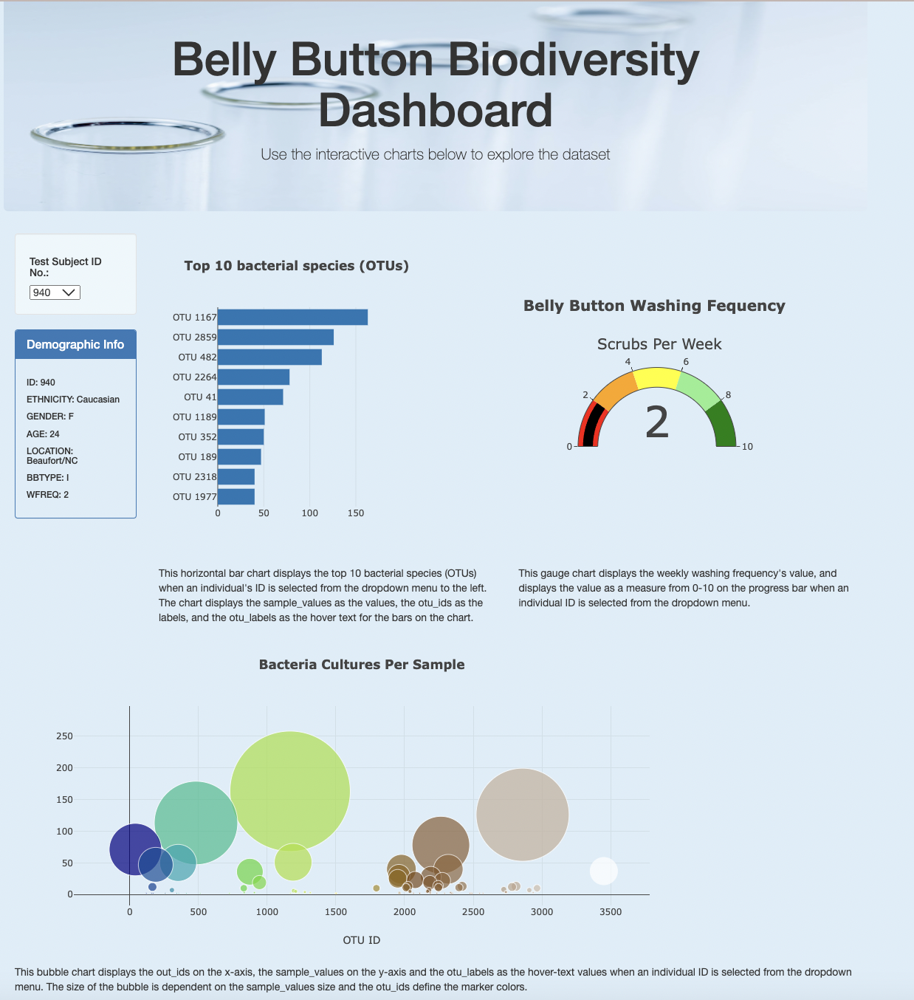

# Belly Button Diversity with Plotly

## Overview of the Analysis
Roza is a biological research in a prominent microbiology laboratory.
Roza's role is to discover and document these bacteria. In particular, Roza is interested in bacterial species that have the ability to synthesize proteins that taste like beef. 

Roza hypothesizes that the ideal bacterial species to make synthetic beef, may be found in the belly button, or at least in someone's belly button. 

To test her hypothesis, Roza has sampled the navels of people across the country to identify bacterial species that colonize our belly buttons. 

Roza wanted to build a dashboard that both her research participants and fellow researchers can access. Those who participated in the study will be able to visit a website and select their ID numbers to see which bacterial species lives in their navels. 

Roza had a partially completed dashboard. She has a completed panel for demographic information and now needs to visualize the bacterial data for each volunteer. Specifically, her volunteers should be able to identify the top 10 bacterial species in their belly buttons. That way, if Improbable Beef identifies a species as a candidate to manufacture synthetic beef, Roza's volunteers will be able to identify whether that species is found in their navel.

## Analysis Process 

### Created a Horizontal Bar Chart
Used JavaScript, Plotly, and D3.js, to create a horizontal bar chart to display the top 10 bacterial species (OTUs) when an individual’s ID is selected from the dropdown menu on the webpage. The horizontal bar chart displays the sample_values as the values, the otu_ids as the labels, and the otu_labels as the hover text for the bars on the chart.

For more information on how this was done, please see the [charts](charts.js) file.

### Created a Bubble Chart
Used  JavaScript, Plotly, and D3.js, to create a bubble chart that displays the following when an individual’s ID is selected from the dropdown menu webpage:

* The otu_ids as the x-axis values.
* The sample_values as the y-axis values.
* The sample_values as the marker size.
* The otu_ids as the marker colors.
* The otu_labels as the hover-text values.

For more information on how this was done, please see the [charts](static/js/charts.js) file.

### Created a Gauge Chart
Used JavaScript, Plotly, and D3.js to create a gauge chart that displays the weekly washing frequency's value, and displays the value as a measure from 0-10 on the progress bar in the gauge chart when an individual ID is selected from the dropdown menu.

For more information on how this was done, please see the [charts](static/js/charts.js) file.

### Customized the Dashboard
Used HTML and Bootstrap to make the following three customizations on the webpage for the dashboard:
* Added an image to the jumbotron.
* Added background color to the webpage.
* Added information about what each graph visualizes under each graph.

For more information on how this was done, please see the following files:
* [index](index.html)
* [charts](static/js/charts.js) 
* [style](static/css/style.css)

## Final Dashboard

The final dashboard webpage looks like the following image.

